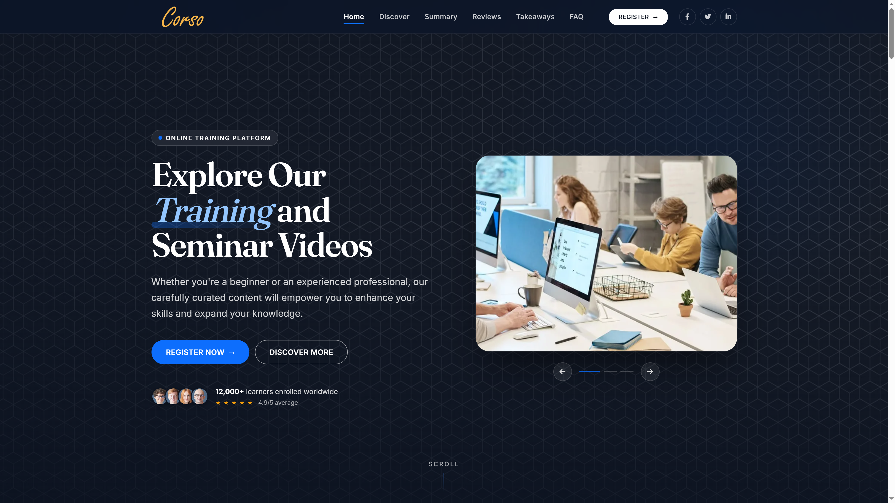
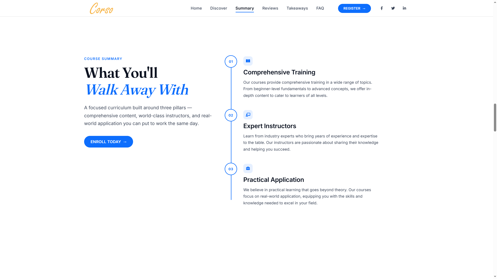
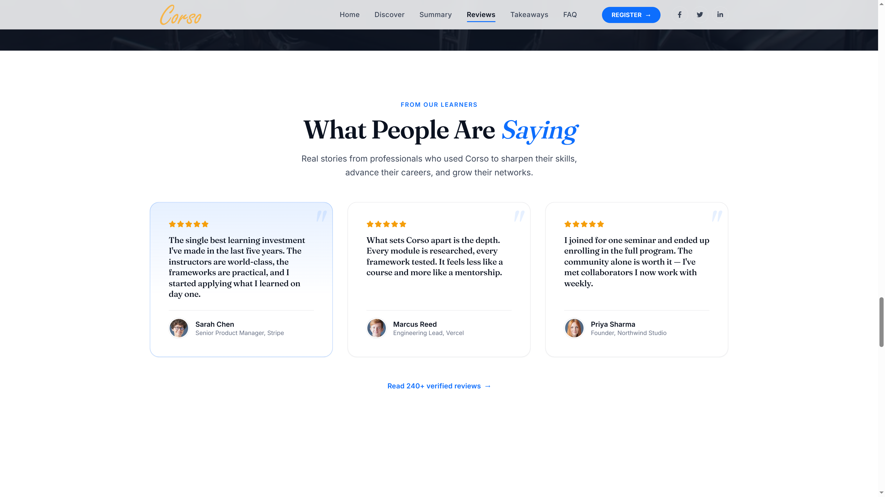
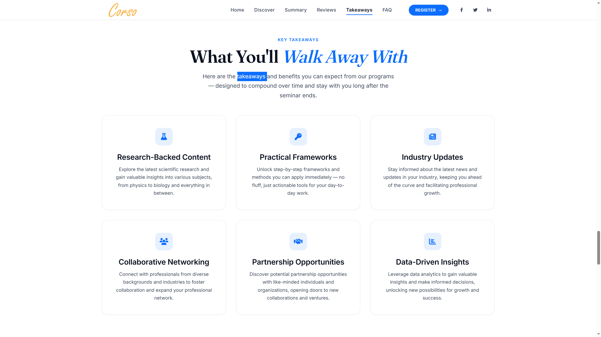
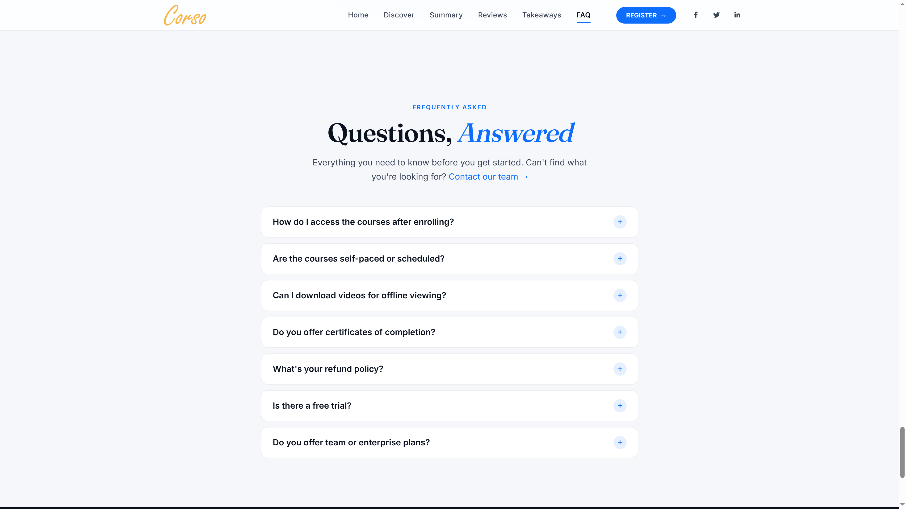
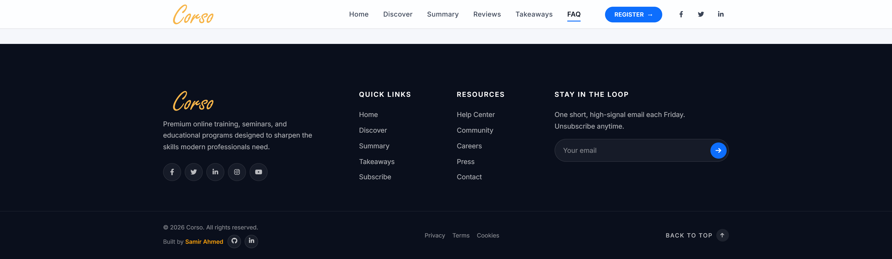

# Corso - Online Learning Platform Landing Page

A modern, responsive landing page for an online learning platform focused on professional training, expert-led seminars, practical knowledge, and continuous learning.

The project was designed as a complete product marketing experience, combining educational content, social proof, event promotion, and conversion-focused sections into a long-form responsive website.



## Live Demo

**Live Website:** (https://samirahmed00.github.io/Corso-Learning-Platform-Landing-Page/)

---

## Overview

Corso is a fictional online learning platform offering professional courses, training videos, live seminars, and educational resources.

The website is structured to guide visitors from the initial value proposition through the platform's features, curriculum, live events, testimonials, resources, newsletter signup, and final conversion points.

---

## Key Features

* Modern responsive landing page
* Long-form marketing layout
* Responsive navigation
* Hero section with strong primary CTA
* Course and training presentation
* Feature-driven content sections
* Course summary and learning outcomes
* Live seminar promotion
* Event details and registration CTA
* Customer testimonials
* Social proof and platform statistics
* Research and resources section
* Newsletter subscription section
* Responsive footer navigation
* Smooth scrolling and UI interactions
* Mobile-first responsive behavior

---

## Website Sections

* Hero
* Platform Introduction
* Create Your Account
* Discover Corso
* Platform Statistics
* Learning Benefits
* Course Summary
* Live Events
* Featured Seminar
* Testimonials
* Research-Backed Content
* Practical Frameworks
* Industry Updates
* Collaborative Networking
* Partnership Opportunities
* Data-Driven Insights
* Newsletter
* Footer

---

## Design & Interaction

The website focuses on creating a professional educational platform experience through:

* Strong visual hierarchy
* Content-driven layouts
* Clear section transitions
* Interactive navigation
* Responsive cards
* Conversion-focused CTAs
* Consistent typography
* Responsive spacing and layout behavior
* Smooth scrolling and subtle motion

---

## Responsive Design

The layout is optimized for:

* Desktop
* Laptop
* Tablet
* Mobile

Content, cards, navigation, typography, spacing, and imagery adapt to smaller screens to maintain usability and readability.

---

## Tech Stack

* HTML5
* CSS3
* JavaScript
* Responsive Web Design
* GSAP
* ScrollTrigger
* Modern CSS Layout
* CSS Animations & Transitions

---

## Screenshots

### Hero


### Platform Features


### Course Summary



### Live Events



### Featured Seminar



### Testimonials



### Footer



### Responsive Screen


---

## Getting Started

Clone the repository:

```bash
git clone https://github.com/SamirAhmed00/Corso-Learning-Platform-Landing-Page.git
```

Open the project directory and launch the main HTML file in a modern browser.

If the project uses a local development server, run it through your preferred development environment.

---

## Project Goals

This project was created to explore how a professional educational platform can communicate a large amount of information without sacrificing visual hierarchy, usability, or conversion flow.

The focus was on building a realistic long-form product website rather than a minimal single-section landing page.

---

## Author

**Samir Ahmed**

Backend .NET Developer with a strong interest in modern web development, UI engineering, and software architecture.

* GitHub: [SamirAhmed00](https://github.com/SamirAhmed00)
* LinkedIn: [Samir Ahmed](https://www.linkedin.com/in/samir-ahmed00/)
